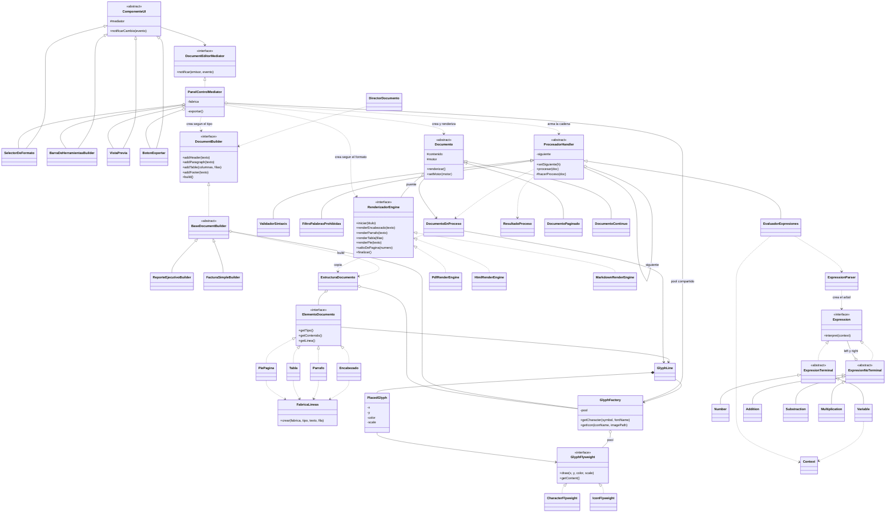

# Integración de Patrones: Motor de Documentos Inteligentes

Proyecto desarrollado en **Java** que integra seis patrones de diseño de software: **Bridge, Builder, Chain of Responsibility, Flyweight, Interpreter y Mediator**.

El proyecto implementa un pequeño **motor de documentos inteligentes** capaz de construir, validar, procesar y renderizar diferentes tipos de documentos en distintos formatos de salida. La arquitectura permite combinar los patrones para que cada uno resuelva una responsabilidad específica y, al mismo tiempo, puedan trabajar de manera coordinada dentro de un flujo completo.

El motor permite trabajar con documentos como:

- Reportes ejecutivos.
- Facturas simples.
- Documentos con encabezados, párrafos, tablas y pies de página.
- Fórmulas matemáticas embebidas.
- Variables dinámicas.
- Caracteres e iconos reutilizables mediante Flyweight.
- Diferentes formatos de salida: **PDF, HTML y Markdown**.

---

## Objetivo del proyecto

El objetivo principal es demostrar la aplicación práctica e integrada de diferentes patrones de diseño sobre un mismo sistema.

Cada patrón se utiliza para solucionar un problema específico:

- **Mediator:** coordina los diferentes componentes de la interfaz y evita que estos dependan directamente entre sí.
- **Builder:** permite construir documentos complejos paso a paso.
- **Flyweight:** permite reutilizar objetos que se repiten y reducir el consumo de memoria.
- **Chain of Responsibility:** procesa y valida el documento mediante una cadena de responsables.
- **Interpreter:** interpreta y resuelve expresiones matemáticas y variables incluidas dentro del documento.
- **Bridge:** separa la estructura del documento del formato en el que será renderizado.

La integración de estos patrones permite obtener una arquitectura modular, extensible y con responsabilidades claramente separadas.

---

## Integrantes

| Nombre | Código |
| --- | --- |
| Ángela Sofía Puentes Medina | 20241020114 |
| Sharon Stefany Castilla Araque | 20251020089 |
| Sergio Steven Vanegas Cuervo | 20232020076 |
| Juan Sneyder Mendez Gil | 20251020010 |
| Eddie Santiago Rondon Capera | 20251020108 |
| Luna Alejandra Sandoval Rodríguez | 20241020053 |
---

# Patrones implementados

## 1. Mediator

**Paquete:** `mediator`

El patrón **Mediator** centraliza la comunicación entre los componentes del panel de control.

En lugar de que cada componente conozca directamente a los demás, todos se comunican mediante `PanelControlMediator`.

### Clases principales

- `DocumentEditorMediator`
- `ComponenteUI`
- `PanelControlMediator`
- `SelectorDeFormato`
- `BarraDeHerramientasBuilder`
- `VistaPrevia`
- `BotonExportar`

### Responsabilidad

El Mediator se encarga de:

- Coordinar los componentes de la interfaz.
- Determinar qué tipo de Builder utilizar.
- Determinar qué motor de renderizado utilizar.
- Configurar el formato de salida.
- Construir la cadena de procesamiento.
- Coordinar la exportación del documento.

De esta manera, los componentes de la interfaz no necesitan conocer directamente la implementación de los demás componentes.

---

## 2. Builder

**Paquete:** `builder`

El patrón **Builder** permite construir un documento paso a paso.

Un documento puede estar compuesto por diferentes elementos, como:

- Encabezado.
- Párrafos.
- Tablas.
- Pie de página.

### Clases principales

- `DocumentBuilder`
- `BaseDocumentBuilder`
- `ReporteEjecutivoBuilder`
- `FacturaSimpleBuilder`
- `DirectorDocumento`
- `EstructuraDocumento`
- `ElementoDocumento`
- `Encabezado`
- `Parrafo`
- `Tabla`
- `PiePagina`

### Operaciones principales

```text
addHeader()
addParagraph()
addTable()
addFooter()
build()
```
Esto permite crear diferentes tipos de documentos sin tener que construir manualmente toda su estructura.
Por ejemplo, el sistema puede utilizar ReporteEjecutivoBuilder para crear un reporte, mientras que FacturaSimpleBuilder puede utilizarse para construir una factura.

3. Flyweight
Paquete: flyweight
El patrón Flyweight se utiliza para optimizar el uso de memoria cuando existen muchos elementos repetidos.
En este proyecto se reutilizan principalmente:
- Caracteres.
- Iconos.
La clase GlyphFactory mantiene un pool compartido de objetos Flyweight.

Clases principales:
- GlyphFlyweight
- CharacterFlyweight
- IconFlyweight
- GlyphFactory
- GlyphLine
- PlacedGlyph

Funcionamiento:
El objeto compartido contiene la información que puede reutilizarse, mientras que la información específica de cada aparición se almacena por separado.
Por ejemplo:
```
CharacterFlyweight
    ├── símbolo
    └── fuente
```
Mientras que:
```
PlacedGlyph
    ├── posición X
    ├── posición Y
    ├── color
    └── escala
```
De esta forma, si una misma letra aparece cientos de veces, no es necesario crear un objeto completamente nuevo para cada aparición.
La GlyphFactory comprueba primero si el Flyweight ya existe. Si existe, lo reutiliza; si no existe, lo crea y lo almacena en el pool.

4. Chain of Responsibility
Paquete: chain
El patrón Chain of Responsibility permite procesar el documento mediante una secuencia de responsables.
La cadena implementada es:
```
ValidadorSintaxis
        ↓
FiltroPalabrasProhibidas
        ↓
EvaluadorExpresiones
```
Clases principales:
- ProcesadorHandler
- ValidadorSintaxis
- FiltroPalabrasProhibidas
- EvaluadorExpresiones
- DocumentoEnProceso
- ResultadoProceso

Responsabilidades:
- ValidadorSintaxis: Comprueba que el documento tenga una estructura válida antes de continuar.
- FiltroPalabrasProhibidas: Busca contenido que no debería pasar al siguiente proceso.
- EvaluadorExpresiones: Detecta y evalúa las fórmulas incluidas dentro del documento.

Una característica importante es que un error crítico puede detener la cadena inmediatamente.
Por ejemplo:
```
Documento
   ↓
ValidadorSintaxis
   ↓
FiltroPalabrasProhibidas
   ↓
EvaluadorExpresiones
   ↓
Renderizado
```
Si el primer proceso encuentra un error crítico:
```
Documento
   ↓
ValidadorSintaxis
   ↓
ERROR
   X
```
el documento no continúa hacia los siguientes handlers.

5. Interpreter
Paquete: interpreter
El patrón Interpreter permite interpretar expresiones matemáticas incluidas dentro de los documentos.
Las expresiones utilizan el formato:
```
#{EXPRESION}
```
Por ejemplo:
```
#{PRECIO_BASE * 1.19 - DESCUENTO}
```
El sistema analiza la expresión y construye una estructura que posteriormente es evaluada.

Clases principales:
- Expression
- ExpresionTerminal
- ExpresionNoTerminal
- Number
- Variable
- Addition
- Substraction
- Multiplication
- Context
- ExpressionParser

Operaciones soportadas:
El intérprete permite trabajar con:
```
- +
- -
- *
```
Además, se respeta la precedencia matemática. Por ejemplo:
```
2 + 3 * 4
```
se interpreta como:
```
2 + (3 * 4)
```
y no como (2 + 3) * 4.

También se admiten paréntesis:
```
(2 + 3) * 4
```
y variables:
```
#{PRECIO_BASE * 1.19 - DESCUENTO}
```
También se puede utilizar:
```
#{FECHA_ACTUAL}
```
para representar una variable disponible en el contexto.
Cuando una variable no existe, el sistema puede identificar la situación y mostrar el resultado correspondiente sin ocultar el error.

6. Bridge
Paquete: bridge
El patrón Bridge separa la abstracción del documento de la implementación utilizada para renderizarlo.
Esto permite que el mismo documento pueda ser generado en diferentes formatos sin modificar su estructura.

Abstracción:
- Documento
- DocumentoPaginado
- DocumentoContinuo

Implementación:
- RenderizadorEngine
- PdfRenderEngine
- HtmlRenderEngine
- MarkdownRenderEngine

La relación puede representarse de la siguiente manera:
```
Documento
    │
    └── RenderizadorEngine
            ├── PDF
            ├── HTML
            └── Markdown
```
Por ejemplo, un mismo documento puede utilizar:
DocumentoPaginado + PdfRenderEngine
o:
DocumentoPaginado + HtmlRenderEngine
sin necesidad de crear una nueva clase para cada combinación.

Integración de los patrones
Una de las características principales del proyecto es que los patrones no funcionan de forma aislada.
El flujo general es:

             USUARIO
                │
                ▼
       ┌─────────────────┐
       │     Mediator    │
       └────────┬────────┘
                │
        configura Builder
        y Renderizador
                │
                ▼
       ┌─────────────────┐
       │     Builder     │
       └────────┬────────┘
                │
        construye documento
                │
                ▼
       ┌─────────────────┐
       │    Flyweight    │
       └────────┬────────┘
                │
       reutiliza caracteres
          e iconos
                │
                ▼
       ┌─────────────────┐
       │      Chain      │
       └────────┬────────┘
                │
       valida y procesa
                │
                ▼
       ┌─────────────────┐
       │   Interpreter   │
       └────────┬────────┘
                │
       evalúa expresiones
                │
                ▼
       ┌─────────────────┐
       │     Bridge      │
       └────────┬────────┘
                │
        selecciona motor
                │
       ┌────────┼─────────┐
       ▼        ▼         ▼
      PDF      HTML    Markdown

Flujo completo del sistema
El funcionamiento completo del motor se puede resumir en los siguientes pasos:
1. Configuración: El usuario selecciona el tipo de documento y el formato de salida. El PanelControlMediator recibe estos cambios y coordina los componentes correspondientes.
2. Selección del Builder: Dependiendo del tipo de documento seleccionado, el Mediator determina qué Builder utilizar.
   - Reporte ejecutivo → ReporteEjecutivoBuilder
   - Factura → FacturaSimpleBuilder
3. Construcción: El Builder construye el documento utilizando operaciones como addHeader(), addParagraph(), addTable(), y addFooter(). Finalmente, build() produce la estructura del documento.
4. Optimización mediante Flyweight: Durante la construcción se generan líneas de glifos. Los caracteres e iconos repetidos son obtenidos desde GlyphFactory, evitando crear múltiples instancias innecesarias.
5. Procesamiento: El documento pasa por la cadena: ValidadorSintaxis → FiltroPalabrasProhibidas → EvaluadorExpresiones. Cada handler realiza su responsabilidad antes de permitir que el documento continúe.
6. Evaluación de expresiones: Cuando se encuentran expresiones como #{PRECIO_BASE * 1.19 - DESCUENTO}, el EvaluadorExpresiones utiliza el ExpressionParser y las clases del patrón Interpreter para obtener el resultado.
7. Renderizado: Finalmente, el patrón Bridge permite utilizar el motor correspondiente (PdfRenderEngine, HtmlRenderEngine, MarkdownRenderEngine). El documento mantiene su estructura independientemente del formato seleccionado.

Ejemplo de flujo:

Tipo de documento: Reporte Ejecutivo | Formato: PDF
        ↓
PanelControlMediator
        ↓
ReporteEjecutivoBuilder
        ↓
EstructuraDocumento
        ↓
GlyphFactory (reutilización de caracteres e iconos)
        ↓
ValidadorSintaxis
        ↓
FiltroPalabrasProhibidas
        ↓
EvaluadorExpresiones
        ↓
Interpreter
        ↓
DocumentoPaginado
        ↓
PdfRenderEngine
        ↓
Documento PDF

Ejemplo de expresión:
El sistema puede procesar una expresión como:

#{PRECIO_BASE * 1.19 - DESCUENTO}

Si el contexto contiene:
PRECIO_BASE = 100000
DESCUENTO = 5000
la expresión se interpreta como: 100000 * 1.19 - 5000.
Primero se realiza la multiplicación: 100000 * 1.19 = 119000
Posteriormente la resta: 119000 - 5000 = 114000
Resultado: 114000
Esto permite generar documentos con información calculada dinámicamente.

Manejo de errores
El proyecto contempla diferentes situaciones de error durante el procesamiento:
- Sintaxis incorrecta.
- Expresiones inválidas.
- Variables inexistentes.
- Palabras prohibidas.
- Errores críticos durante el procesamiento.
- Intentos de continuar el flujo cuando una validación anterior ha fallado.

Cuando un error es crítico, la cadena puede detenerse:
```
ValidadorSintaxis
       │
       ├── Correcto → Siguiente handler
       │
       └── Error crítico → Detener proceso
```
Esto evita que un documento inválido llegue directamente al renderizador.

Estructura del proyecto:
```
src/
│
├── Main.java
│
├── mediator/
│   ├── DocumentEditorMediator
│   ├── PanelControlMediator
│   ├── ComponenteUI
│   ├── SelectorDeFormato
│   ├── BarraDeHerramientasBuilder
│   ├── VistaPrevia
│   └── BotonExportar
│
├── builder/
│   ├── DocumentBuilder
│   ├── BaseDocumentBuilder
│   ├── ReporteEjecutivoBuilder
│   ├── FacturaSimpleBuilder
│   ├── DirectorDocumento
│   ├── EstructuraDocumento
│   └── elementos
│
├── flyweight/
│   ├── GlyphFlyweight
│   ├── CharacterFlyweight
│   ├── IconFlyweight
│   ├── GlyphFactory
│   ├── GlyphLine
│   └── PlacedGlyph
│
├── chain/
│   ├── ProcesadorHandler
│   ├── ValidadorSintaxis
│   ├── FiltroPalabrasProhibidas
│   ├── EvaluadorExpresiones
│   ├── DocumentoEnProceso
│   └── ResultadoProceso
│
├── interpreter/
│   ├── Expression
│   ├── ExpresionTerminal
│   ├── ExpresionNoTerminal
│   ├── Number
│   ├── Variable
│   ├── Addition
│   ├── Substraction
│   ├── Multiplication
│   ├── Context
│   └── ExpressionParser
│
└── bridge/
    ├── Documento
    ├── DocumentoPaginado
    ├── DocumentoContinuo
    ├── RenderizadorEngine
    ├── PdfRenderEngine
    ├── HtmlRenderEngine
    └── MarkdownRenderEngine
```
Requisitos
Para ejecutar el proyecto se necesita:
- JDK 11 o superior.
- Un IDE como: Visual Studio Code, NetBeans o IntelliJ IDEA.
- Terminal con acceso al comando javac y java.

Cómo ejecutar

Desde VS Code o NetBeans:
Abrir el proyecto y ejecutar la clase principal: src/Main.java

Desde Linux o macOS:
javac -encoding UTF-8 -d bin $(find src -name "*.java")
java -cp bin Main

Desde PowerShell:
javac -encoding UTF-8 -d bin (Get-ChildItem -Recurse -Path src -Filter *.java | ForEach-Object { $_.FullName })
java -cp bin Main

Qué demuestra el Main
La clase Main funciona como demostración de la integración de los seis patrones. El programa ejecuta un flujo compuesto por diferentes escenarios:
1. Configuración mediante Mediator: Se configura el tipo de documento, el Builder y el formato de salida mediante el PanelControlMediator.
2. Construcción y renderizado: Se crea un documento utilizando Builder, se utilizan Flyweights para los elementos repetidos, se procesa mediante Chain of Responsibility y finalmente se renderiza en PDF.
3. Cambio de formato: El mismo documento puede cambiar de formato mediante el Mediator (ejemplo: PDF → HTML) sin tener que reconstruir completamente la lógica del documento.
4. Factura en Markdown: Se construye una factura simple mediante FacturaSimpleBuilder y se renderiza utilizando MarkdownRenderEngine.
5. Evaluación mediante Interpreter: Se prueban expresiones con operaciones matemáticas, precedencia, paréntesis, variables, FECHA_ACTUAL y variables inexistentes.
6. Interrupción de la cadena: Finalmente, se demuestra cómo un error crítico puede detener el procesamiento antes de llegar al siguiente handler.

Demostración de Flyweight
Al finalizar la ejecución se muestran los objetos Flyweight creados y las solicitudes realizadas al pool. Esto permite observar la diferencia entre:
- Objetos solicitados
- Objetos realmente creados
La idea es demostrar que muchos usos del mismo carácter o icono pueden compartir una única instancia.

Ejemplo conceptual:

Solicitudes:
A A A A A A A A

Objetos creados:
1 CharacterFlyweight("A")

En lugar de:
8 CharacterFlyweight("A")

Esto reduce sustancialmente la cantidad de objetos repetidos en memoria.

Ventajas de la arquitectura
La integración de los patrones permite obtener varias ventajas:
- Separación de responsabilidades: Cada patrón resuelve un problema específico y las clases no concentran toda la lógica del sistema.
- Reutilización: Los componentes pueden reutilizarse para diferentes tipos de documentos y formatos.
- Extensibilidad: Es posible agregar nuevos Builders, nuevos renderizadores o nuevos elementos sin modificar toda la arquitectura (por ejemplo, agregar WordRenderEngine o ContratoBuilder).
- Reducción de dependencias: Mediator y Bridge ayudan a reducir el acoplamiento entre componentes.
- Optimización: Flyweight evita crear múltiples objetos idénticos cuando pueden ser compartidos.
- Procesamiento controlado: Chain of Responsibility permite organizar las diferentes validaciones y procesos de manera sequencial.
- Expresiones dinámicas: Interpreter permite incorporar fórmulas dentro de los documentos sin tener que programar cada fórmula individualmente.

Relación entre los patrones

| Patrón | Responsabilidad principal |
| --- | --- |
| Mediator | Coordinar los componentes y configurar el flujo |
| Builder | Construir el documento paso a paso |
| Flyweight | Reutilizar caracteres e iconos |
| Chain of Responsibility | Validar y procesar el documento |
| Interpreter | Resolver expresiones y variables |
| Bridge | Separar documento y formato de salida |

La combinación puede resumirse así:
```
Mediator
   │
   ├── selecciona Builder
   │
   ├── selecciona Renderizador
   │
   └── configura Chain
           │
           ▼
        Builder
           │
           ▼
       Flyweight
           │
           ▼
         Chain
           │
           ▼
      Interpreter
           │
           ▼
        Bridge
           │
       ┌───┼────┐
       ▼   ▼    ▼
      PDF HTML Markdown
```

## UML:



Conclusión
El proyecto demuestra cómo diferentes patrones de diseño pueden integrarse dentro de una misma aplicación para resolver problemas concretos de arquitectura y organización del código.
El Mediator coordina el sistema, el Builder construye los documentos, Flyweight optimiza los objetos repetidos, Chain of Responsibility controla el procesamiento, Interpreter permite evaluar expresiones y Bridge permite cambiar el formato de salida sin modificar la estructura del documento.
De esta manera, el motor puede construir y procesar documentos de forma modular, permitiendo incorporar nuevos tipos de documentos, expresiones, validaciones o formatos de salida sin tener que modificar completamente el sistema.
-->
